# BarCode

An Android app that powers a **QR-based mobile bar experience** for events — guests scan an event QR, browse a bartender-curated cocktail menu, and place live drink orders that flow in real-time to a bartender's order screen.

Built with Kotlin and Firebase, BarCode covers the full event lifecycle: bartenders publish their personal cocktail menu, hosts plan events and pick which drinks to serve via a swipe-to-choose UI, guests order from their phones, and bartenders fulfill orders live with instant guest notifications.

---

## Table of Contents

- [Features](#features)
- [Roles](#roles)
- [App Flow & Screens](#app-flow--screens)
- [Technologies](#technologies)
- [Project Structure](#project-structure)
- [Setup](#setup)
- [Data Model](#data-model)

---

## Features

- **Three roles** in one app — Bartender (Admin), Event Host, and Guest
- **Google Sign-In + Email/Password** authentication via Firebase Auth
- **QR code event check-in** — guests scan an event QR with the device camera to join
- **Swipe-to-pick menu builder** (Tinder-style) — hosts swipe through a bartender's cocktails to build the event menu
- **Real-time orders** — guests place orders and bartenders see them instantly on a live order board
- **Push-to-ready** — when the bartender marks an order ready, the guest's phone vibrates, plays a sound, and shows a "Drink Ready" dialog
- **Selfie attachment** — guests can attach a selfie to their order so the bartender knows who's picking up
- **Insights dashboard** — monthly events, total drinks poured, best-selling cocktail, sales breakdown, and trend vs. last month
- **Cocktail image uploads** — bartenders upload cocktail photos to Firebase Storage
- **Share code system** — bartenders generate a 6-character share code that hosts use to link them to an event

---

## Roles

| Role | What they do |
|------|--------------|
| **Bartender (Admin)** | Builds & manages a personal cocktail menu, generates a share code, accepts events, runs the live order board, views insights |
| **Event Host** | Creates events (date, time, location, billing type), connects a bartender via share code, picks the drink menu, gets a shareable event QR |
| **Guest** | Scans the event QR, enters name (and optional selfie), browses the menu, taps to order, gets notified when the drink is ready |

---

## App Flow & Screens

### 1. Splash & Login
The app opens on a splash screen and routes to login. Users can sign in with email/password, Google, or scan an event QR as a guest.

<p align="center">
  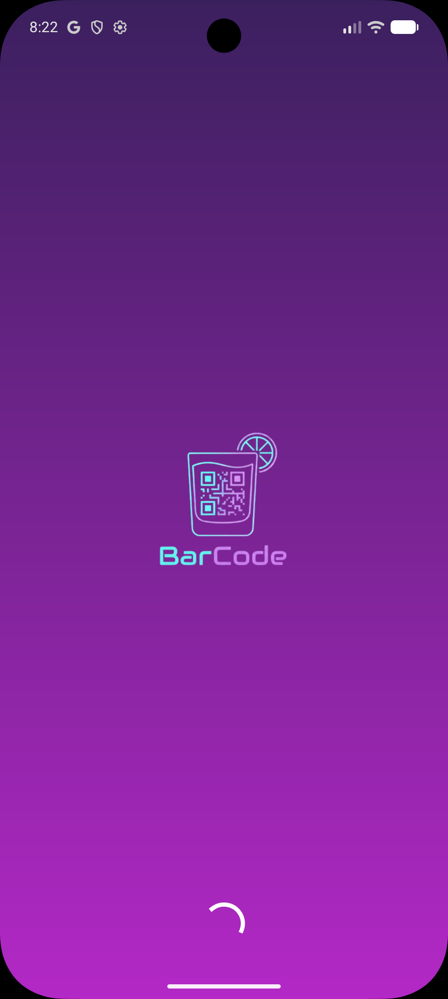
  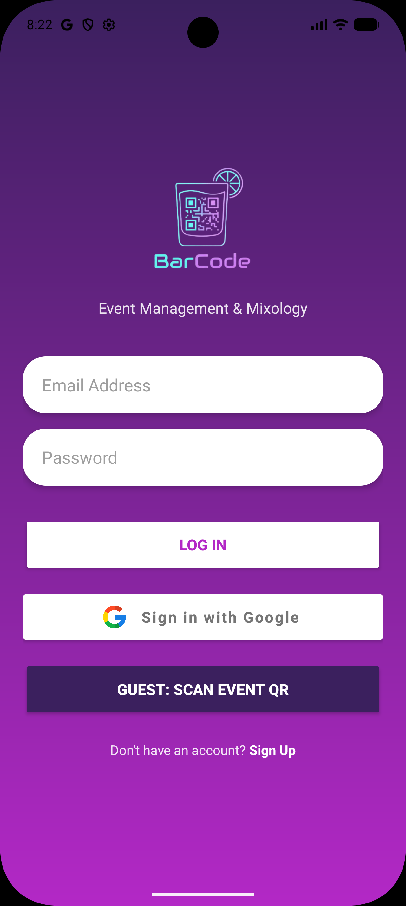
</p>

### 2. Bartender (Admin) Experience
After login, bartenders land on a dashboard with their upcoming events and a tab bar for **Events / Cocktails / Insights / Settings**.

<p align="center">
  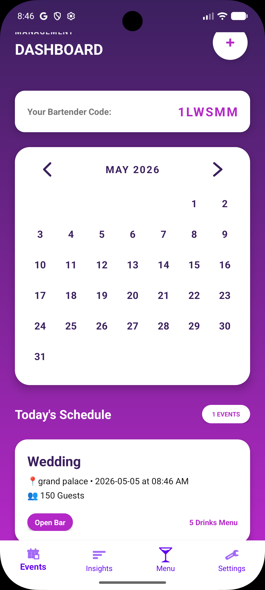
  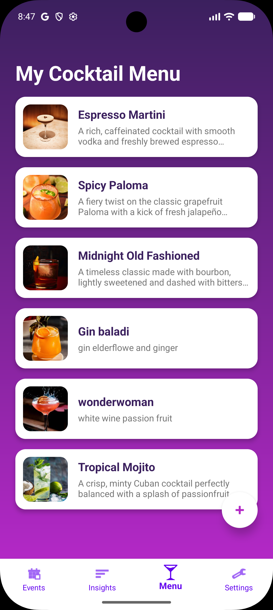
</p>

### 3. Host Experience — Build an Event
Hosts create a new event, pick a date on the calendar, set time and billing type (Open Bar / Pay-per-Drink), connect a bartender via share code, then **swipe through the bartender's cocktails** to build the event menu (max 5).

<p align="center">
  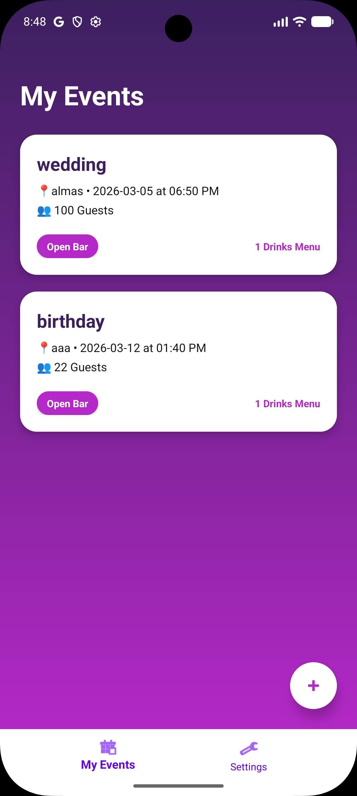
  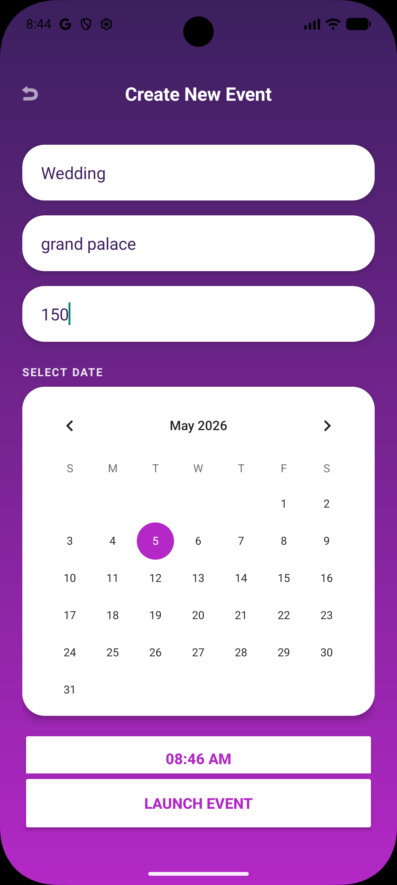
  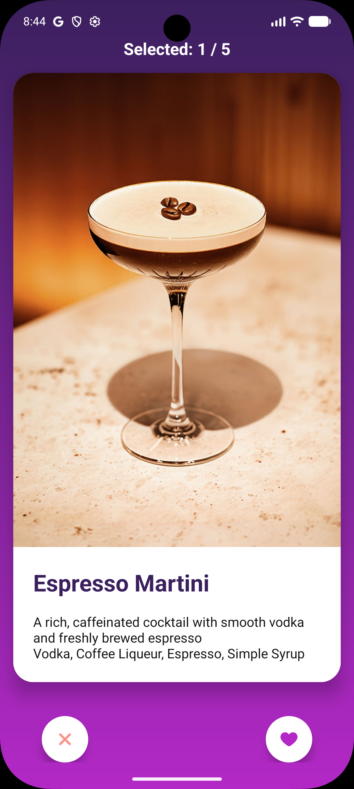
  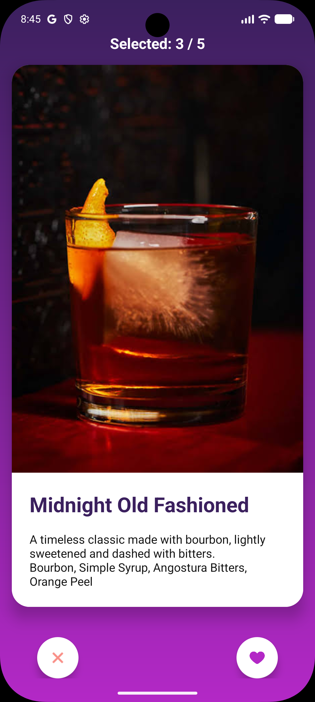
</p>

### 4. Event Details & QR
Once saved, the event has a unique QR code that the host shares with guests at the venue.

<p align="center">
  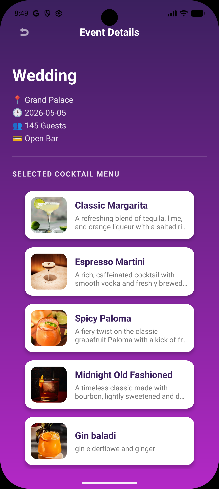
  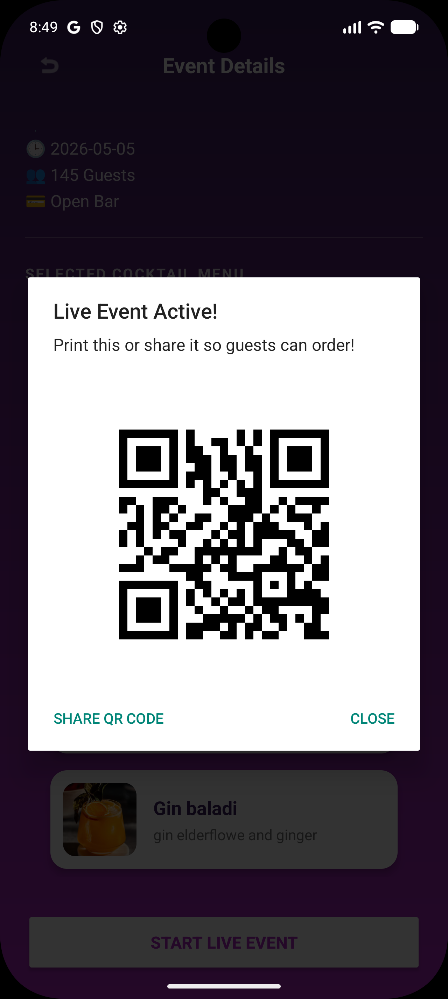
</p>

### 5. Guest Experience — Scan & Order
Guests scan the event QR from the login screen, type their name, optionally attach a selfie, and tap a drink to order. A waiting overlay appears until the bartender marks the order ready.

<p align="center">
  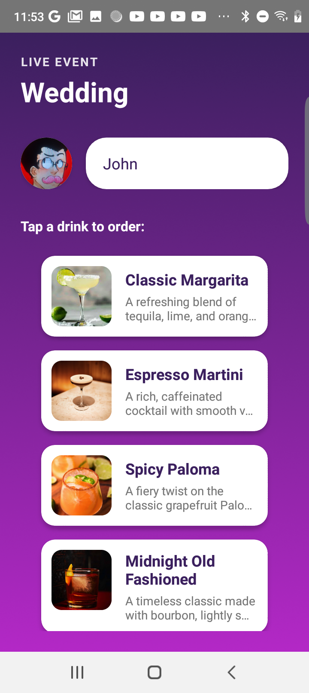
  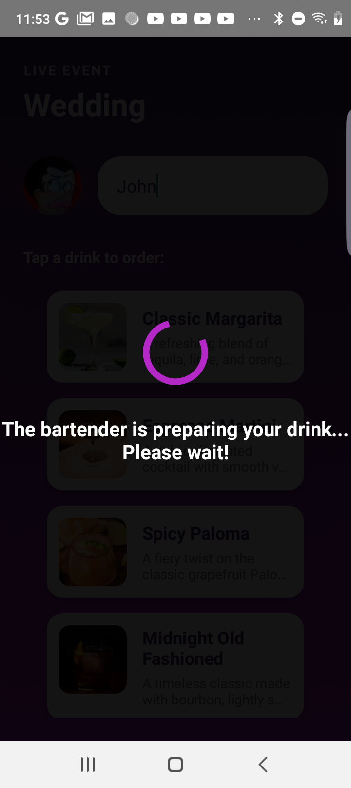
  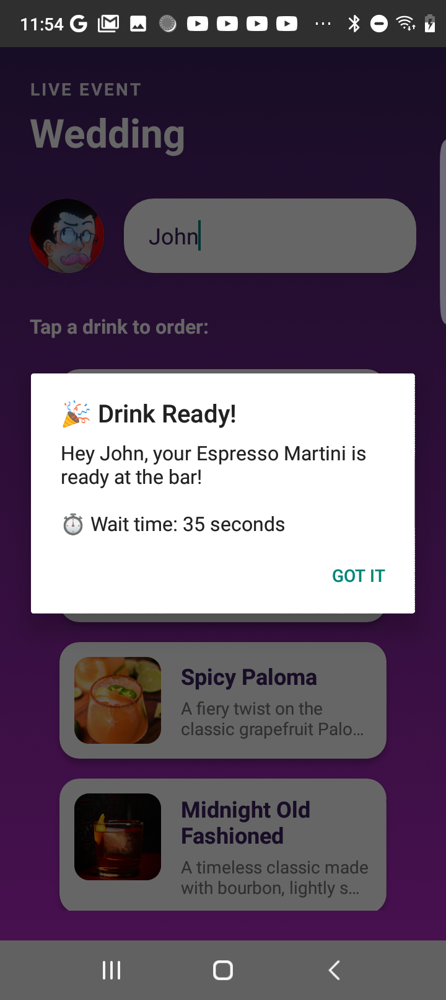
</p>

### 6. Live Bartender Board
Bartenders see incoming orders in real-time (sorted by timestamp) with the guest's name, drink, and selfie. Tap an order to mark it ready — the guest gets a vibration + sound notification.

<p align="center">
  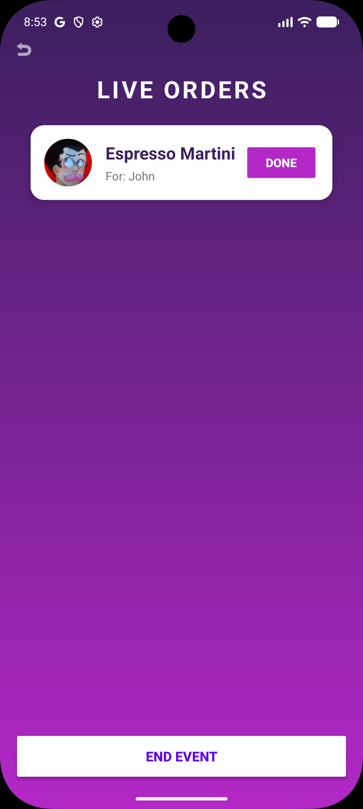
</p>

### 7. Insights
Monthly stats per role: events this month, drinks poured, best-selling cocktail, full sales breakdown, and percentage trend vs. last month.

<p align="center">
  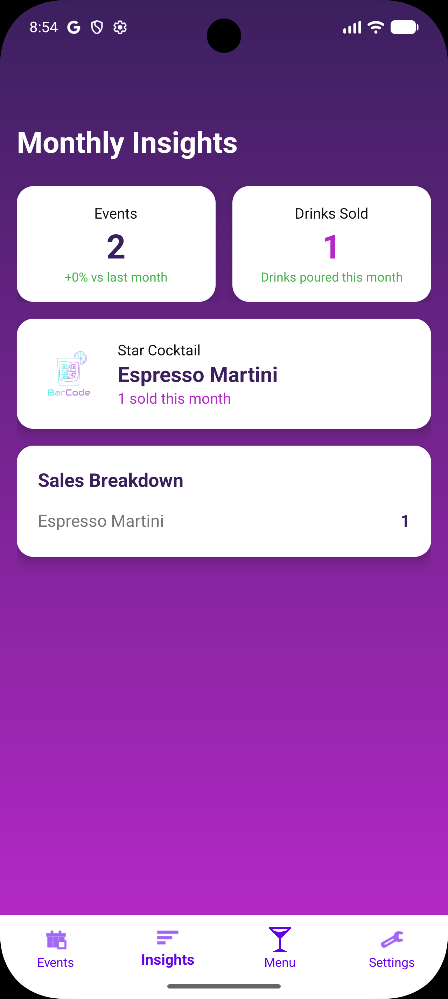
</p>

---

## Technologies

### Language & Build
- **Kotlin** 2.0.21
- **Android Gradle Plugin** 8.13.2
- **Min SDK** 27 · **Target SDK** 36
- **Java 11** toolchain

### Android / UI
- AndroidX **AppCompat**, **Material Components**, **ConstraintLayout**
- **ViewBinding** + Fragments + `BottomNavigationView`
- **Jetpack Compose** (BOM 2024.09.00) — wired in for future screens
- **Parcelize** for passing data classes between screens
- **Edge-to-edge** layouts with `WindowInsetsCompat`

### Firebase (BoM 32.7.0)
- **Firebase Auth** — email/password, Google, anonymous (for guests)
- **Cloud Firestore** — users, events, cocktails
- **Realtime Database** (`europe-west1`) — live order queue + status updates
- **Firebase Storage** — cocktail images and guest selfies

### Other Libraries
- **Glide** 4.16.0 — image loading + circle crops
- **ZXing (`zxing-android-embedded` 4.3.0)** — QR scanning + generation
- **Google Play Services Auth** 20.7.0 — Google Sign-In
- **Kizitonwose Calendar View** 2.5.0 — date selection in event creation

### Device Features
- Camera (selfies, QR scan)
- Vibration (`VibrationManager`)
- Sound effects (`SoundEffectPlayer`)
- FileProvider for sharing event QRs

---

## Project Structure

```
app/src/main/java/com/example/barcode/
├── auth/                  # LoginActivity, SignUpActivity
├── data/                  # Event, Order data classes
├── model/                 # Cocktail, User data classes
├── firebase/
│   └── FirebaseManager.kt # All Firestore, RTDB, Storage calls
├── ui/
│   ├── SplashActivity.kt
│   ├── AdminHostActivity.kt        # Hosts the bottom-nav fragments per role
│   ├── AdminDashBoardFragment.kt
│   ├── HostDashBoardFragment.kt
│   ├── MenuDashboardFragment.kt
│   ├── InsightsFragment.kt
│   ├── SettingsFragment.kt
│   ├── NewEventActivity.kt
│   ├── EventDetailsActivity.kt
│   ├── AddCocktailActivity.kt
│   ├── CocktailSwipeActivity.kt    # Tinder-style menu builder
│   ├── GuestMenuActivity.kt        # Guest-facing menu + ordering
│   └── LiveBartenderActivity.kt    # Real-time order board
└── utils/
    ├── UserManager.kt              # In-memory cached current user
    ├── EventAdapter.kt
    ├── CocktailMenuAdapter.kt
    ├── LiveOrderAdapter.kt
    ├── CalendarHelper.kt
    ├── SoundEffectPlayer.kt
    └── VibrationManager.kt
```

---

## Setup

### Prerequisites
- Android Studio (Hedgehog or newer recommended)
- Android device or emulator running API 27+
- A Firebase project

### Steps

1. **Clone the repository**
   ```bash
   git clone <repo-url>
   cd BarCode
   ```

2. **Add your Firebase config**
   - Create a Firebase project at [console.firebase.google.com](https://console.firebase.google.com)
   - Register an Android app with package `com.example.barcode`
   - Download `google-services.json` and drop it into `app/`
   - Enable: **Authentication** (Email/Password, Google, Anonymous), **Firestore**, **Realtime Database** (region `europe-west1` or update the URL in `FirebaseManager.kt`), and **Storage**

3. **Open in Android Studio** and let Gradle sync.

4. **Run** on a device or emulator (`Shift+F10`).

> The Realtime Database URL is hardcoded in `FirebaseManager.kt`. If your RTDB lives in a different region, update the URL there.

---

## Data Model

### `users` (Firestore)
```
uid · name · email · role ("admin" | "host") · shareCode
```

### `cocktails` (Firestore)
```
cocktailId · bartenderId · name · description · ingredients · imageUrl
```

### `events` (Firestore)
```
eventId · hostId · eventName · location · numOfGuests
dateString · timeString · timestamp · scheduledTimeMillis
billingType · status ("upcoming" | "completed")
selectedCocktailIds · menu[] · bartenderIds[]
```

### `orders/{eventId}/{orderId}` (Realtime Database)
```
orderId · eventId · guestName · cocktailName
timestamp · status ("pending" | "completed") · guestImageUrl
```
